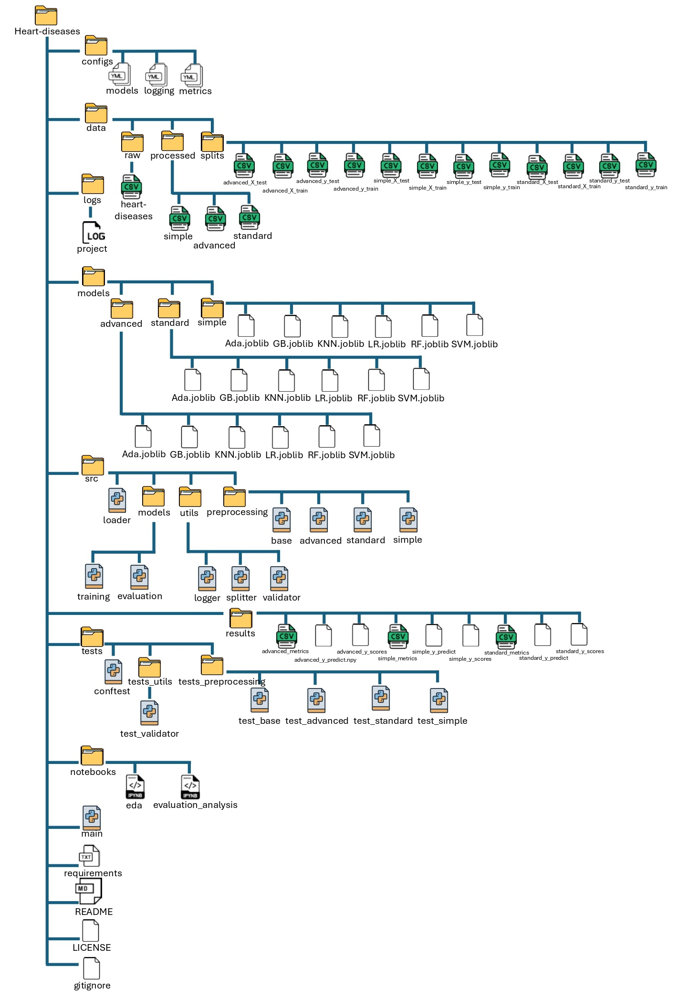

# **Heart-diseases**
## **General Info**

**Version:** 1.0

**Date:** 2026

**Data source:** https://www.kaggle.com/datasets/fedesoriano/heart-failure-prediction

**Goal:** identify the best preprocessing pipeline and model for predicting heart failure
## **Table of contents**
1. [General Info](#General-Info)
2. [Data Description](#Data-Description)
3. [Project Description](#Project-Description)
4. [Results](#Results)
5. [Project Structure](#Project-Structure)
6. [Full ML Pipeline](#Full-ML-Pipeline)
7. [Notes](#Notes)
8. [Technologies Used](#Technologies-Used)
9. [How To Run](#How-To-Run)

## **Data Description**

The Data Set contains 918 records and 12 **attributes**:

(*See the full analysis notebooks\eda*)

1. **Age** - age of the patient (years)
2. **Sex** - sex of the patient
    * M - male
    * F - female

3. **ChestPainType** - chest pain type
    * TA - Typical Angina
    * ATA - Atypical Angina
    * NAP - Non-Anginal Pain
    * ASY - Asymptomatic

4. **RestingBP** - resting blood pressure (mm Hg)
5. **Cholesterol** - serum cholesterol (mm/dl)
6. **FastingBS** - fasting blood sugar
    * 1 - if FastingBS > 120 mg/dl
    * 0 - otherwise

7. **RestingECG** - resting electrocardiogram results
    * Normal - normal
    * ST - having ST-T wave abnormality (T wave inversions and/or ST elevation or depression of > 0.05 mV)
    * LVH - showing probable or definite left ventricular hypertrophy by Estes' criteria
  
8. **MaxHR** - maximum heart rate achieved
    * Numeric value between 60 and 202

9. **ExerciseAngina** - exercise-induced angina
    * Y - Yes
    * N - No
  
10. **Oldpeak** -  ST depression induced by exercise relative to rest (numeric)
11. **ST_Slope** - the slope of the peak exercise ST segment
    * Up - upsloping
    * Flat - flat
    * Down - downsloping

12. **HeartDisease** - output class
    * 1 - heart disease
    * 0 - Normal

## **Project Description**
The project performs an EDA analysis, based on which the necessary data preprocessing steps are determined and 3 methods are implemented that differ in the methods of performing these steps:
1. **Simple pipeline**

    Contains minimal processing steps:

    - Rows with missing values are removed
    - Outliers are filtered using a predefined threshold
    - No feature scaling
    - One-Hot Encoding using Pandas

2. **Standard pipeline**

    Includes common preprocessing steps:

    - Missing values are replaced with mean (for numerical) and mode (for categorical)
    - Outliers are removed based on percentiles (IQR: 75 - 25)
    - One-Hot Encoding using Scikit-Learn
    - Feature scaling with StandardScaler

3. **Advanced pipeline**

    Applies more sophisticated preprocessing:

    - Categorical values are encoded by frequency
    - Missing values are imputed using KNNImputer
    - Feature scaling with RobustScaler
    - Outliers are removed using IsolationForest

Each pipeline produces a separate train-test split and corresponding trained **models**:

1. LogisticRegression
2. svm.SVC
3. KNeighborsClassifier
4. RandomForestClassifier
5. GradientBoostingClassifier
6. AdaBoostClassifier

The performance of each pipeline and model was evaluated using the following **metrics**:
1. Accuracy
2. Precision
3. Recall
4. F2
Additionally, confusion matrices, ROC curves, and PR curves were analyzed.

## **Results**  
(*Full analysis of the results see  \notebooks\evaluation_analysis*)

The best and the worst results in the table

|Pipeline|Model|Recall|Precision|F2|
|-------|-----|-------|-------|-----|
|Advanced Preprocessing|Gradient Boosting|0.91|0.84|0.90|
|Simple Preprocessing|KNN|0.74|0.66|0.73|

## **Project Structure**

## **Full ML Pipeline**
* **main.py** - the orchestrator
* models, metrics, and logs are configured via yaml
  

## **Notes**
1. Pipelines are fully configurable via YAML files.
2. the tests cover part of the project at the moment:
   * src\preprocessing
   * src\utils\validator
3. Validator cover part of the project at the moment:
   * src\preprocessing
   * loader
   * main
5. Improvements are planned in future versions.

## **Technologies Used**
Developed and tested using Python 3.14

Libraries:
* PyYAML
* pandas
* pytest
* numpy
* scikit-learn
* joblib
* matplotlib
* seaborn

Analysis performed using Jupyter Notebook.

## **How to run**
Detailed instructions will be provided later
